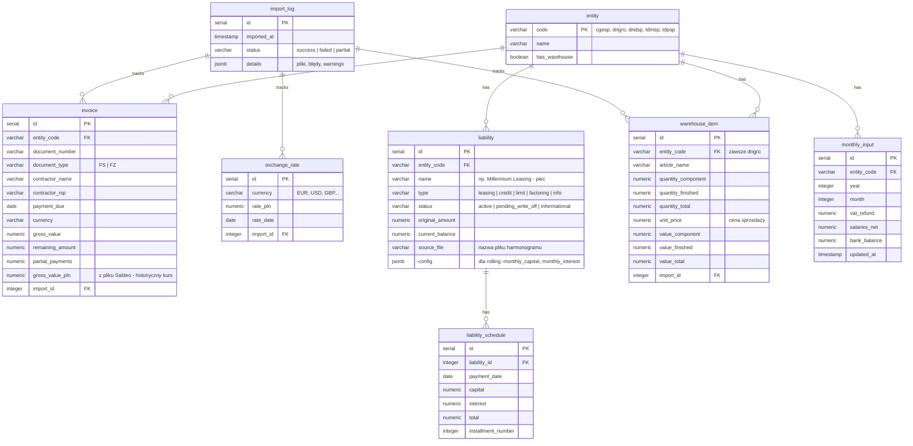

# feat: Dashboard finansowy dla grupy DND (Viktor)

## Przegląd

Budowa dashboardu finansowego dla właścicieli grupy spółek (CGE, DND Group, DND, TDM, TDP). System konsoliduje dane z plików Saldeo, harmonogramów kredytowych i ręcznych danych w jedno miejsce z widokami należności, zobowiązań, magazynu i projekcją cashflow. AI asystent Viktor odpowiada na pytania w języku naturalnym.

## Ujęcie problemu

Właściciele grupy 5 spółek nie mają jednego miejsca z aktualną sytuacją finansową. Dane rozproszone w Saldeo (per podmiot), plikach Excel/PDF harmonogramów i rozmowach z księgowymi. Brak konsolidacji utrudnia zarządzanie płynnością na poziomie grupy. (zob. źródło: `docs/dev-brainstorms/2026-04-11-dashboard-finansowy-requirements.md`)

## Śledzenie wymagań

- **R1.** Import 5 plików Saldeo (Excel, 48 kolumn, nagłówki w wierszu 3). Filtrowanie: `_FS_` = należności, `_FZ_` = zobowiązania. Snapshot nadpisujący.
- **R2.** Import zestawienia magazynowego (tylko `dngro`). Nagłówki wielopoziomowe, wartość w cenie sprzedaży.
- **R3.** Import harmonogramów zobowiązań finansowych (15 pozycji: pliki + konfiguracja stała + pozycje informacyjne).
- **R4.** Formularz ręczny per podmiot per miesiąc: VAT, wynagrodzenia netto, saldo bankowe. Historia.
- **R5.** Widok skonsolidowany grupy + zakładki per podmiot.
- **R6.** Przeliczanie walut kursem NBP pobranym raz przy imporcie.
- **R7a.** Należności per kontrahent: "7 dni", "30 dni", "Przeterminowane".
- **R7b.** Zobowiązania handlowe per kontrahent: analogicznie jak R7a.
- **R7c.** Harmonogram płatności zobowiązań finansowych (timeline).
- **R7d.** Prognoza wpływów (naive — kontrahent płaci na termin). Przeterminowane osobno.
- **R7e.** Stany magazynowe — tylko zakładka `dngro`.
- **R7f.** Lista zobowiązań finansowych + sekcja informacyjna (ISAG, NCBiR, PARP).
- **R8.** Viktor AI: Claude Haiku 4.5 / Sonnet 4.6, function calling, hardcap $20/mies.
- **R9.** ~~Proaktywny alert~~ WYCIĘTY. Projekcja cashflow on-demand przez Viktora.
- **R10.** Shared password + JWT HttpOnly cookie, 30 dni, max 5 osób.

## Granice scope'u

- Brak integracji API z Saldeo ani bankami
- Brak OCR (LFR.pdf wpisany ręcznie przy setupie)
- Brak automatycznych przypomnień do kontrahentów
- Brak fakturowania ani edycji danych źródłowych
- Brak wielopoziomowych uprawnień
- Brak proaktywnych alertów (R9 wycięte)
- Brak historii faktur (snapshot nadpisujący)
- Mobile best-effort, desktop-first

## Kontekst i research

### Relevantny kod i wzorce

Projekt **greenfield** — brak istniejącego kodu. Zasoby danych w `zasoby/`:
- 5× `lista-dokumentow-{cgesp,dngro,dndsp,tdmsp,tdpsp}.xlsx` — pliki Saldeo
- `Zestawienie magazynowe DND 10.04.26.xlsx` — magazyn
- `zaobowiazania/` — 14 plików harmonogramów (Excel + PDF) + master zobowiązań

Infrastruktura Claude Code gotowa: 18+ skillów, agenty, pipeline `/dev-*`.

### Wiedza instytucjonalna

- Skill `coolify-manager` — pełna dokumentacja CLI v1.4.0 + API do deploymentu
- Skill `tailwind-react-guidelines` — wytyczne frontend (React 19 + TailwindCSS v4 + shadcn/ui)
- Skill `claude-api` — integracja Anthropic SDK z function calling

### Referencje zewnętrzne

Nie wymagane — technologie standardowe, requirements doc v2 wystarczająco szczegółowy.

## Kluczowe decyzje techniczne

### Backend: Fastify

**Uzasadnienie:** Natywne TypeScript, wbudowana walidacja JSON Schema (przydatna do walidacji upload/API), dobra wydajność, czysty async/await. Lepszy DX niż Express, bardziej dojrzały ekosystem pluginów niż Hono.

### Struktura: Monorepo pnpm workspaces

```
/
├── packages/
│   ├── frontend/          # React 19 + Vite + shadcn/ui
│   ├── backend/           # Fastify + TypeScript
│   └── shared/            # Współdzielone typy i stałe (entity codes, enums)
├── docker-compose.yml     # Dev: PostgreSQL + backend + frontend
├── pnpm-workspace.yaml
├── package.json
└── tsconfig.base.json
```

### Definicja "ten tydzień": Rolling `dziś + 7 dni`

**Uzasadnienie:** Zawsze aktualny widok niezależnie od dnia tygodnia. Sekcje w R7a/R7b: "Najbliższe 7 dni" (termin ∈ [dziś, dziś+7)), "Najbliższe 30 dni" (termin ∈ [dziś+7, dziś+30)), "Przeterminowane" (termin < dziś AND Zapłacono = NIE).

### Atomowość importu: Transakcja per pełny cykl

Import 5 plików Saldeo w jednej transakcji DB. Jeśli parser któregokolwiek pliku failuje — rollback całości. Walidacja struktury (nagłówki, kolumny) **przed** modyfikacją DB.

### NBP API: Cache + retry

Pobranie kursu z NBP API z retry (3 próby × 2s backoff). Kurs zapisywany w DB z timestampem. Jeśli API niedostępne — fallback na ostatni znany kurs + warning w UI.

### Korekty faktur (`_KOR_`, `_FS_PF_`, `_PK_`, `_TOW_`)

Filtr regex `^[A-Z]+_FS_$` i `^[A-Z]+_FZ_$` wyklucza korekty (`_FS_KOR_`), proformy (`_FS_PF_`), PK i TOW. Zgodne z requirements doc.

### NIP: Normalizacja przed agregacją

NIP normalizowany do czystych cyfr (usunięcie myślników, spacji, prefixu "PL"). Agregacja per NIP w widoku skonsolidowanym (R5), per podmiot bez agregacji cross-entity.

### Model routing (Viktor): Keyword + complexity heuristic

Backend decyduje: zapytania zawierające słowa kluczowe (prognoza, ryzyko, cashflow, projekcja, analiza, porównaj) → Sonnet 4.6. Pozostałe → Haiku 4.5. Prosty, deterministyczny, łatwy do tuningu.

### Brak danych R4 dla bieżącego miesiąca

Jeśli saldo bankowe nie jest wpisane, projekcja cashflow zwraca warning "Brak salda bankowego dla [miesiąc]. Uzupełnij dane w formularzu." Viktor nie zgaduje — wymaga danych.

## Otwarte pytania

### Rozwiązane podczas planowania

- **Express vs Fastify vs Hono?** → Fastify (DX, walidacja, TypeScript)
- **"Ten tydzień" = pon-niedz czy rolling?** → Rolling dziś + 7 dni
- **Atomowość importu?** → Transakcja per cykl, rollback przy błędzie
- **Routing Haiku/Sonnet?** → Keyword heuristic w backendzie
- **Korekty w filtrze Typ?** → Wykluczone przez regex exact match `_FS_$` / `_FZ_$`
- **Co gdy brak R4?** → Warning, nie fallback na zero

### Odroczone do implementacji

- **Dokładna struktura nagłówków harmonogramów** — każdy plik ma inny layout, parsery pisane per plik z testami na zasobach
- **Finalna lista narzędzi Viktora** — szkic w requirements, dokładne sygnatury po implementacji endpointów API
- **Format JWT sekret + expiry** — konfiguracja przy setupie Coolify env vars
- **Domena + SSL** — konfiguracja Coolify, niezależna od kodu
- **Strategia backupów PostgreSQL** — konfiguracja cron na VPS, niezależna od aplikacji

## Schemat bazy danych (PostgreSQL)



**Indeksy:**
- `invoice(entity_code, document_type, payment_due)` — filtrowanie widoków R7a/R7b
- `invoice(contractor_nip)` — agregacja per kontrahent
- `liability_schedule(liability_id, payment_date)` — timeline R7c
- `monthly_input(entity_code, year, month)` — UNIQUE constraint

## API Endpoints (Fastify)

### Auth
- `POST /api/auth/login` — `{ password }` → JWT HttpOnly cookie
- `POST /api/auth/logout` — clear cookie
- `GET /api/auth/me` — verify session

### Import
- `POST /api/import/saldeo` — multipart upload 5 plików Excel → transakcyjny import
- `POST /api/import/warehouse` — upload 1 plik Excel → import magazynu
- `POST /api/import/schedules` — upload harmonogramów (setup, jednorazowo lub update)
- `GET /api/import/status` — ostatni import: data, status, warnings

### Dane (read-only, chronione JWT)
- `GET /api/receivables?entity=all|{code}&period=7d|30d|overdue`
- `GET /api/payables?entity=all|{code}&period=7d|30d|overdue`
- `GET /api/liabilities?entity=all|{code}&type=all|active|info`
- `GET /api/liabilities/schedule?entity=all|{code}&months=12`
- `GET /api/warehouse` (zawsze `dngro`)
- `GET /api/forecast?days=30` — prognoza wpływów
- `GET /api/cashflow?days=30` — projekcja cashflow (saldo + wpływy - wypływy)
- `GET /api/dashboard/summary?entity=all|{code}` — widok skonsolidowany
- `GET /api/exchange-rates` — aktualne kursy

### R4 — dane ręczne
- `GET /api/monthly-input?entity={code}&year={y}&month={m}`
- `PUT /api/monthly-input` — upsert per podmiot per miesiąc

### Viktor AI
- `POST /api/viktor/chat` — `{ message, history? }` → odpowiedź AI

## Narzędzia Viktora (function calling)

| Tool | Opis | Mapowanie API |
|---|---|---|
| `get_receivables` | Należności per podmiot/grupa, opcjonalnie per kontrahent | `/api/receivables` |
| `get_payables` | Zobowiązania handlowe per podmiot/grupa | `/api/payables` |
| `get_overdue` | Przeterminowane (należności + zobowiązania) | `/api/receivables?period=overdue` + `/api/payables?period=overdue` |
| `get_liability_schedule` | Harmonogram zobowiązań finansowych | `/api/liabilities/schedule` |
| `get_cashflow_projection` | Projekcja płynności na N dni | `/api/cashflow` |
| `get_warehouse_value` | Stan i wartość magazynu | `/api/warehouse` |
| `get_entity_summary` | Podsumowanie podmiotu (należności + zobowiązania + saldo) | `/api/dashboard/summary` |

Viktor otrzymuje system prompt z kontekstem biznesowym (nazwy podmiotów, skróty, waluta bazowa PLN) i odpowiada w języku polskim.

## Wpływ systemowy

- **Graf interakcji:** Frontend → Fastify API → PostgreSQL. NBP API wywoływane tylko przy imporcie. Claude API wywoływane tylko przy zapytaniach Viktora.
- **Propagacja błędów:** Parser errors → rollback transakcji → UI pokazuje listę błędów. API errors → standaryzowany format `{ data, error: { code, message } }`. Viktor tool errors → tekstowa odpowiedź "nie mogę pobrać danych".
- **Ryzyka cyklu życia stanu:** Import nadpisuje snapshot — dane między importami są statyczne. Monthly_input jest addytywny (upsert, nie nadpisanie). Exchange_rate jest per import.
- **Parytet surface API:** Endpointy receivables/payables mają identyczną strukturę (DRY). Widok skonsolidowany agreguje te same endpointy z `entity=all`.
- **Pokrycie integracyjne:** Parser Saldeo testowany na prawdziwych plikach z `zasoby/`. Import transakcyjny testowany end-to-end. Viktor testowany z mockiem Claude API.

## Implementation Units

### Faza 1: Fundament

- [x] **Unit 1: Scaffolding monorepo + konfiguracja**

  **Cel:** Działający monorepo z pnpm workspaces, TypeScript, ESLint, Docker Compose dla dev PostgreSQL.

  **Wymagania:** Fundament dla wszystkich kolejnych unitów.

  **Zależności:** Brak.

  **Pliki:**
  - Stwórz: `pnpm-workspace.yaml`
  - Stwórz: `package.json` (root)
  - Stwórz: `tsconfig.base.json`
  - Stwórz: `packages/frontend/package.json`
  - Stwórz: `packages/frontend/vite.config.ts`
  - Stwórz: `packages/frontend/tsconfig.json`
  - Stwórz: `packages/frontend/index.html`
  - Stwórz: `packages/frontend/src/main.tsx`
  - Stwórz: `packages/frontend/src/app.tsx`
  - Stwórz: `packages/backend/package.json`
  - Stwórz: `packages/backend/tsconfig.json`
  - Stwórz: `packages/backend/src/server.ts`
  - Stwórz: `packages/shared/package.json`
  - Stwórz: `packages/shared/tsconfig.json`
  - Stwórz: `packages/shared/src/index.ts` (typy: EntityCode, InvoiceType, enums)
  - Stwórz: `docker-compose.yml` (PostgreSQL 16 + pgAdmin opcjonalnie)
  - Stwórz: `.env.example`
  - Stwórz: `.gitignore`
  - Stwórz: `.nvmrc` (Node 22 LTS)

  **Podejście:**
  - pnpm workspaces z `packages/*`
  - TypeScript strict mode, path aliases
  - Vite dev server z proxy do backend (`/api` → localhost:3001)
  - Fastify z `@fastify/cors`, `@fastify/cookie`, `@fastify/multipart`
  - Docker Compose: PostgreSQL 16 na porcie 5432, volume dla danych
  - `.env`: `DATABASE_URL`, `DASHBOARD_PASSWORD`, `JWT_SECRET`, `ANTHROPIC_API_KEY`, `NBP_API_URL`

  **Wzorce do naśladowania:**
  - Skill `tailwind-react-guidelines` dla konfiguracji frontend

  **Scenariusze testowe:**
  - [Unit] `pnpm install` wykonuje się bez błędów
  - [Unit] `pnpm --filter backend dev` startuje Fastify na porcie 3001
  - [Unit] `pnpm --filter frontend dev` startuje Vite na porcie 5173 z proxy
  - [Unit] TypeScript kompiluje się bez błędów we wszystkich packages

  **Weryfikacja:**
  - Oba serwery dev startują poprawnie
  - Frontend proxy przekierowuje `/api/*` do backendu
  - PostgreSQL dostępny z docker-compose

---

- [x] **Unit 2: Schema bazy danych + migracje**

  **Cel:** Kompletny schemat PostgreSQL z tabelami, indeksami i migracjami.

  **Wymagania:** R1, R2, R3, R4, R6 (struktury danych).

  **Zależności:** Unit 1.

  **Pliki:**
  - Stwórz: `packages/backend/src/db/connection.ts`
  - Stwórz: `packages/backend/src/db/migrations/001-initial-schema.sql`
  - Stwórz: `packages/backend/src/db/migrate.ts` (runner migracji)
  - Stwórz: `packages/backend/src/db/seed-entities.ts` (5 podmiotów)
  - Stwórz: `packages/backend/src/db/seed-liabilities.ts` (15 pozycji master + konfiguracje rolling)
  - Test: `packages/backend/src/db/__tests__/migrations.test.ts`

  **Podejście:**
  - Biblioteka: `postgres` (porsager/postgres) — lekka, natywne TypeScript, bez ORM
  - Migracje: prosty runner SQL (pliki numerowane, tabela `_migrations`)
  - Seed: 5 encji + 15 pozycji liability (z mapowania harmonogramów w requirements)
  - Schemat zgodny z diagramem ERD powyżej
  - UNIQUE constraint na `monthly_input(entity_code, year, month)`
  - Indeksy na kolumnach filtrujących (entity_code, document_type, payment_due, contractor_nip)

  **Wzorce do naśladowania:**
  - Schemat ERD z sekcji "Schemat bazy danych" tego planu

  **Scenariusze testowe:**
  - [Unit] Migracja tworzy wszystkie tabele i indeksy
  - [Unit] Seed wstawia 5 encji i 15 pozycji liability
  - [Unit] Powtórne uruchomienie migracji jest idempotentne
  - [Unit] UNIQUE constraint na monthly_input działa (duplikat → error)

  **Weryfikacja:**
  - Wszystkie tabele istnieją z poprawnymi typami kolumn
  - Seed data obecna w entity i liability

---

- [x] **Unit 3: Autoryzacja (shared password + JWT)**

  **Cel:** Endpoint logowania, middleware JWT, ochrona tras API.

  **Wymagania:** R10.

  **Zależności:** Unit 1.

  **Pliki:**
  - Stwórz: `packages/backend/src/auth/login.ts`
  - Stwórz: `packages/backend/src/auth/middleware.ts`
  - Stwórz: `packages/backend/src/auth/constants.ts`
  - Test: `packages/backend/src/auth/__tests__/auth.test.ts`

  **Podejście:**
  - `POST /api/auth/login`: porównanie `password` z `process.env.DASHBOARD_PASSWORD` (timing-safe compare)
  - JWT generowany z `@fastify/jwt`, payload: `{ authenticated: true, iat }`, expiry 30 dni
  - Cookie: `HttpOnly`, `Secure`, `SameSite=Strict`, `Path=/`
  - Middleware Fastify `onRequest` hook — weryfikuje JWT z cookie, zwraca 401
  - Logout: nadpisanie cookie expired

  **Scenariusze testowe:**
  - [Unit] Poprawne hasło → 200 + cookie z JWT
  - [Unit] Błędne hasło → 401
  - [Unit] Request bez cookie → 401 na chronionym endpoint
  - [Unit] Request z ważnym JWT → 200
  - [Unit] Request z expired JWT → 401
  - [E2E] Formularz logowania → wpisanie hasła → redirect do dashboardu

  **Weryfikacja:**
  - Chronione endpointy zwracają 401 bez JWT i 200 z JWT
  - Cookie jest HttpOnly i Secure

---

### Faza 2: Pipeline ingestion

- [ ] **Unit 4: Parser plików Saldeo (Excel)**

  **Cel:** Parser 5 plików Saldeo z filtrowaniem należności (`_FS_`) i zobowiązań (`_FZ_`), walidacją struktury i normalizacją NIP.

  **Wymagania:** R1.

  **Zależności:** Unit 2.

  **Pliki:**
  - Stwórz: `packages/backend/src/parsers/saldeo-parser.ts`
  - Stwórz: `packages/backend/src/parsers/nip-normalizer.ts`
  - Stwórz: `packages/backend/src/parsers/types.ts`
  - Test: `packages/backend/src/parsers/__tests__/saldeo-parser.test.ts`
  - Test: `packages/backend/src/parsers/__tests__/nip-normalizer.test.ts`
  - Fixture: referencja do `zasoby/lista-dokumentow-*.xlsx`

  **Podejście:**
  - Biblioteka: `xlsx` (SheetJS) — czytanie Excel
  - Walidacja struktury: sprawdzenie nagłówków w wierszu 3, obecność wymaganych kolumn (`Numer dokumentu`, `Kontrahent`, `NIP`, `Typ`, `Termin płatności`, `Waluta`, `Wartość brutto`, `Zapłacono`, `Pozostało do zapłaty`, `Suma płatności częściowych`)
  - Filtrowanie: regex `^[A-Z]+_FS_$` (należności), `^[A-Z]+_FZ_$` (zobowiązania)
  - Wykluczone typy: `_FS_PF_`, `_PK_`, `_TOW_`, `_KOR_` i inne nie pasujące do exact match
  - NIP normalizacja: usunięcie spacji, myślników, prefixu "PL", walidacja 10 cyfr
  - Kwota: kolumna `Pozostało do zapłaty` (nie `Wartość brutto`)
  - Output: `ParsedInvoice[]` z entity_code wyciągniętym z nazwy pliku

  **Scenariusze testowe:**
  - [Unit] Parsowanie `lista-dokumentow-cgesp.xlsx` → poprawna lista należności i zobowiązań
  - [Unit] Filtr `_FS_` nie łapie `_FS_PF_` ani `_FS_KOR_`
  - [Unit] Filtr `_FZ_` łapie tylko exact `_FZ_`
  - [Unit] Plik z brakującą kolumną → ValidationError z nazwą brakującej kolumny
  - [Unit] NIP z myślnikami "123-456-78-90" → "1234567890"
  - [Unit] NIP z prefixem "PL" → usunięty
  - [Unit] Faktura z `Zapłacono = TAK` → wykluczona
  - [Unit] Faktura z `Remaining = 0` i `Zapłacono = NIE` → dołączona (edge case)

  **Weryfikacja:**
  - Parser poprawnie przetwarza wszystkie 5 plików z `zasoby/`
  - Walidacja struktury odrzuca uszkodzony plik

---

- [ ] **Unit 5: Parser harmonogramów (Excel + PDF)**

  **Cel:** Parsery dla plików harmonogramów kredytów/leasingów. Wyciąganie miesięcznych rat (kapitał + odsetki + total + data).

  **Wymagania:** R3a.

  **Zależności:** Unit 2.

  **Pliki:**
  - Stwórz: `packages/backend/src/parsers/schedule-parser-excel.ts`
  - Stwórz: `packages/backend/src/parsers/schedule-parser-pdf.ts`
  - Stwórz: `packages/backend/src/parsers/schedule-types.ts`
  - Test: `packages/backend/src/parsers/__tests__/schedule-parser.test.ts`
  - Fixture: referencja do `zasoby/zaobowiazania/*.xlsx` i `zasoby/zaobowiazania/*.pdf`

  **Podejście:**
  - Excel: `xlsx` (SheetJS) — każdy harmonogram ma inny layout, parsery per plik/format
  - PDF: `pdf-parse` — ekstrakcja tekstu z czytelnych PDF. `LFR.pdf` (skan) → skip, ręczny wpis
  - Mapowanie 15 pozycji z requirements doc do plików:
    1. `tabela_rat_wynagrodzenia.xlsx` → cgesp / Millennium piec
    2. `tabela_rat_364944.xlsx` → cgesp / Millennium młyn+prasa
    3. `Harmonogram.pdf` → cgesp / Alior Bank
    4. `harmonogram_splat_EFL_6F01694.xlsx` → cgesp / EFL linia
    5. `harmonogram_splat_EFL6F01696.xlsx` → cgesp / EFL piec 1
    6. `harmonogram_splat_EFL6F01695.xlsx` → cgesp / EFL piec 2
    7. ISAG → pozycja informacyjna, brak pliku
    8. `harmonogram_santander_NP6_00258_2023.xlsx` → dngro / Santander Volvo
    9. `Harmonogram_platnosci-dndgr-mercedes.xlsx` → dngro / Mercedes S-klasa
    10. `LFR.pdf` → dngro / LFR (skan, ręczny wpis)
    11. `Harmonogram spłat_nr umowy 01450_PI_24.pdf` → dngro / PKO Leasing
    12-13. ING limit + faktoring → konfiguracja stała (seed, nie parser)
    14. `DNDspzoo-leasing.pdf` → dndsp / Mercedes Leasing
    15. `TDM-leas.xlsx` → tdmsp / Millennium zgrzewarka
  - Output: `ParsedScheduleEntry[]` z liability_id, payment_date, capital, interest, total

  **Notatka wykonawcza:** Zacznij od jednego pliku Excel (np. `tabela_rat_364944.xlsx`) jako wzorca, potem rozszerz na pozostałe. Parsery PDF pisz osobno — inny format danych.

  **Scenariusze testowe:**
  - [Unit] Parsowanie `tabela_rat_364944.xlsx` → lista rat z datami, kapitałem, odsetkami
  - [Unit] Parsowanie `Harmonogram.pdf` (Alior) → lista rat
  - [Unit] `LFR.pdf` → rzuca ScheduleParseError("Skan PDF, wymaga ręcznego wpisu")
  - [Unit] Parsowanie pliku z brakującymi kolumnami → ValidationError
  - [Unit] Sumy rat per harmonogram zgadzają się z kwotą kredytu

  **Weryfikacja:**
  - Parsery przetwarzają wszystkie pliki z `zasoby/zaobowiazania/` (oprócz LFR.pdf)
  - Każdy harmonogram ma poprawne daty i kwoty

---

- [ ] **Unit 6: Parser magazynu + integracja NBP API**

  **Cel:** Parser zestawienia magazynowego (dngro) + pobieranie kursów walut z NBP API.

  **Wymagania:** R2, R6.

  **Zależności:** Unit 2.

  **Pliki:**
  - Stwórz: `packages/backend/src/parsers/warehouse-parser.ts`
  - Stwórz: `packages/backend/src/services/nbp-rates.ts`
  - Test: `packages/backend/src/parsers/__tests__/warehouse-parser.test.ts`
  - Test: `packages/backend/src/services/__tests__/nbp-rates.test.ts`
  - Fixture: referencja do `zasoby/Zestawienie magazynowe DND 10.04.26.xlsx`

  **Podejście:**
  - Magazyn: nagłówki wielopoziomowe (wiersz 1-2), kolumny 9-11 (ilości), 15-17 (wartości), kolumna `Cena` (cena sprzedaży), `Artykuł`
  - Sumowanie: `komponent + gotowe` w jeden stan per artykuł
  - Kolumna M (cena zakupu) → ignorowana
  - NBP API: `https://api.nbp.pl/api/exchangerates/rates/a/{currency}/?format=json`
  - Waluty: EUR, USD, GBP (inne → error). PLN → rate 1.0
  - Retry: 3 próby × 2s backoff. Fallback: ostatni kurs z tabeli `exchange_rate`
  - Kurs zapisywany per import (nie per faktura)

  **Scenariusze testowe:**
  - [Unit] Parsowanie `Zestawienie magazynowe DND 10.04.26.xlsx` → lista artykułów z ilościami i wartościami
  - [Unit] Wartość per artykuł = ilość_total × cena_sprzedaży
  - [Unit] NBP API zwraca kurs EUR → zapis do DB
  - [Unit] NBP API niedostępne → fallback na ostatni kurs + warning
  - [Unit] Nieznana waluta (np. CHF) → error z opisem

  **Weryfikacja:**
  - Parser poprawnie czyta wielopoziomowe nagłówki
  - Łączna wartość magazynu zgadza się z sumą w pliku
  - Kursy walut zapisane w DB

---

- [ ] **Unit 7: Orkiestrator importu (backend + UI upload)**

  **Cel:** Endpoint multipart upload + transakcyjny import do DB. UI z przyciskiem "Importuj" i drag-n-drop.

  **Wymagania:** R1, R2, R3, R6.

  **Zależności:** Unit 3, Unit 4, Unit 5, Unit 6.

  **Pliki:**
  - Stwórz: `packages/backend/src/import/orchestrator.ts`
  - Stwórz: `packages/backend/src/import/routes.ts`
  - Stwórz: `packages/frontend/src/features/import/import-page.tsx`
  - Stwórz: `packages/frontend/src/features/import/file-dropzone.tsx`
  - Stwórz: `packages/frontend/src/features/import/import-status.tsx`
  - Test: `packages/backend/src/import/__tests__/orchestrator.test.ts`
  - Test (e2e): `Scenariusz: Upload 5 plików Saldeo przez drag-n-drop → import → status sukces`

  **Podejście:**
  - `@fastify/multipart` do obsługi upload
  - Orkiestrator:
    1. Waliduj strukturę wszystkich plików (headers, kolumny) — fail fast
    2. Pobierz kursy NBP (jeśli są faktury walutowe)
    3. BEGIN transaction
    4. DELETE istniejące invoice + warehouse_item (snapshot replacement)
    5. INSERT nowe dane z parserów
    6. INSERT exchange_rate
    7. INSERT import_log
    8. COMMIT (lub ROLLBACK przy błędzie)
  - UI: drag-n-drop zone (shadcn/ui), walidacja client-side (typ pliku, nazwy), progress bar, status importu
  - Osobne endpointy: `/api/import/saldeo` (5 plików), `/api/import/warehouse` (1 plik)
  - Harmonogramy importowane osobno (`/api/import/schedules`) — setup jednorazowy lub update

  **Scenariusze testowe:**
  - [Unit] Import 5 poprawnych plików → dane w DB, import_log status=success
  - [Unit] Import z 1 uszkodzonym plikiem → rollback, żadne dane nie zmienione, import_log status=failed
  - [Unit] Import nadpisuje poprzedni snapshot (stare invoice usunięte)
  - [Unit] Import z fakturami EUR → kurs NBP pobrany i zapisany
  - [E2E] Przeciągnij 5 plików → dropzone → kliknij "Importuj" → spinner → "Import zakończony" z datą
  - [E2E] Upload pliku z błędną strukturą → komunikat błędu z opisem problemu

  **Weryfikacja:**
  - Transakcyjność: błąd w jednym pliku = brak zmian w DB
  - Status importu widoczny w UI z datą i listą plików

---

### Faza 3: Dashboard — widoki i formularz

- [ ] **Unit 8: Layout dashboardu + nawigacja + R4 formularz**

  **Cel:** Skeleton dashboardu: layout z zakładkami (Grupa + 5 podmiotów), sidebar/topbar nawigacja, formularz R4.

  **Wymagania:** R4, R5.

  **Zależności:** Unit 3 (auth), Unit 2 (monthly_input).

  **Pliki:**
  - Stwórz: `packages/frontend/src/layouts/dashboard-layout.tsx`
  - Stwórz: `packages/frontend/src/features/auth/login-page.tsx`
  - Stwórz: `packages/frontend/src/features/dashboard/entity-tabs.tsx`
  - Stwórz: `packages/frontend/src/features/dashboard/dashboard-page.tsx`
  - Stwórz: `packages/frontend/src/features/monthly-input/monthly-input-form.tsx`
  - Stwórz: `packages/frontend/src/features/monthly-input/monthly-input-page.tsx`
  - Stwórz: `packages/backend/src/routes/monthly-input.ts`
  - Stwórz: `packages/frontend/src/lib/api-client.ts` (fetch wrapper z cookie auth)
  - Stwórz: `packages/frontend/src/router.tsx` (React Router)
  - Test: `packages/backend/src/routes/__tests__/monthly-input.test.ts`
  - Test (e2e): `Scenariusz: Logowanie → dashboard → przełączanie zakładek podmiotów`

  **Podejście:**
  - React Router z lazy loading per route
  - Layout: topbar z logo + zakładkami podmiotów (Grupa, CGE, DND Group, DND, TDM, TDP) + sidebar z sekcjami (Należności, Zobowiązania, Harmonogram, Prognoza, Magazyn, Import, Dane miesięczne, Viktor)
  - R4 formularz: 5 podmiotów × 3 pola (VAT, wynagrodzenia, saldo). Selector miesiąca. Upsert per submit.
  - shadcn/ui: Tabs, Card, Input, Button, Label, Select
  - TailwindCSS v4 z custom OKLCH palette
  - React Query (`@tanstack/react-query`) do fetchowania danych
  - API client: fetch wrapper z credentials: 'include' (cookie auth)

  **Wzorce do naśladowania:**
  - Skill `tailwind-react-guidelines` dla komponentów i styling
  - Skill `ux-ui-guidelines` dla nawigacji i layout

  **Scenariusze testowe:**
  - [Unit] PUT monthly-input → upsert w DB, 200
  - [Unit] PUT monthly-input z duplikatem (ten sam podmiot+miesiąc) → update
  - [Unit] GET monthly-input → dane dla podmiotu i miesiąca
  - [E2E] Login → dashboard → kliknij zakładkę "CGE" → widok CGE
  - [E2E] Formularz R4 → wypełnij VAT=5000, wynagrodzenia=20000, saldo=150000 → Submit → dane zapisane
  - [E2E] Zmiana miesiąca w R4 → formularz ładuje dane dla wybranego miesiąca

  **Weryfikacja:**
  - Dashboard ładuje się po zalogowaniu
  - Zakładki przełączają widoki per podmiot
  - Formularz R4 zapisuje i odczytuje dane

---

- [ ] **Unit 9: Widoki należności i zobowiązań handlowych (R7a, R7b)**

  **Cel:** Tabele należności i zobowiązań per kontrahent z 3 sekcjami: "7 dni", "30 dni", "Przeterminowane". Widok skonsolidowany i per podmiot.

  **Wymagania:** R7a, R7b, R5.

  **Zależności:** Unit 7 (dane w DB), Unit 8 (layout).

  **Pliki:**
  - Stwórz: `packages/backend/src/routes/receivables.ts`
  - Stwórz: `packages/backend/src/routes/payables.ts`
  - Stwórz: `packages/frontend/src/features/receivables/receivables-page.tsx`
  - Stwórz: `packages/frontend/src/features/receivables/invoice-table.tsx`
  - Stwórz: `packages/frontend/src/features/payables/payables-page.tsx`
  - Stwórz: `packages/shared/src/types/invoice.ts`
  - Test: `packages/backend/src/routes/__tests__/receivables.test.ts`
  - Test: `packages/backend/src/routes/__tests__/payables.test.ts`
  - Test (e2e): `Scenariusz: Dashboard → Należności → 3 sekcje z kwotami per kontrahent`

  **Podejście:**
  - Backend: SQL z GROUP BY contractor_nip, filtr po payment_due ranges
    - "7 dni": `payment_due >= today AND payment_due < today + 7`
    - "30 dni": `payment_due >= today + 7 AND payment_due < today + 30`
    - "Przeterminowane": `payment_due < today`
  - Widok skonsolidowany (`entity=all`): agregacja per NIP z wszystkich 5 podmiotów
  - Widok per podmiot: filtr po entity_code
  - Kwoty walutowe przeliczone do PLN (JOIN exchange_rate)
  - Sortowanie: kwota malejąco
  - Frontend: 3 karty (Card) z tabelami (DataTable shadcn/ui), sumy per sekcja
  - Widoczna data ostatniego importu

  **Scenariusze testowe:**
  - [Unit] GET receivables?entity=all&period=7d → należności z terminem w [dziś, dziś+7)
  - [Unit] GET receivables?entity=cgesp&period=overdue → przeterminowane CGE
  - [Unit] Faktura EUR przeliczona do PLN kursem z exchange_rate
  - [Unit] Agregacja per NIP w widoku skonsolidowanym — ten sam NIP z 2 podmiotów = 1 wiersz
  - [E2E] Dashboard → Należności → 3 sekcje widoczne → kwoty per kontrahent → suma na dole sekcji
  - [E2E] Przełączenie na zakładkę "CGE" → tylko należności CGE

  **Weryfikacja:**
  - Trzy sekcje z poprawnym podziałem czasowym
  - Sumy PLN poprawne (w tym przeliczenia walutowe)
  - Agregacja per NIP działa w widoku grupy

---

- [ ] **Unit 10: Widok zobowiązań finansowych (R7c, R7f)**

  **Cel:** Lista zobowiązań finansowych z harmonogramem (timeline) + sekcja informacyjna (ISAG, NCBiR, PARP).

  **Wymagania:** R7c, R7f, R3.

  **Zależności:** Unit 5 (harmonogramy w DB), Unit 8 (layout).

  **Pliki:**
  - Stwórz: `packages/backend/src/routes/liabilities.ts`
  - Stwórz: `packages/frontend/src/features/liabilities/liabilities-page.tsx`
  - Stwórz: `packages/frontend/src/features/liabilities/liability-timeline.tsx`
  - Stwórz: `packages/frontend/src/features/liabilities/liability-list.tsx`
  - Stwórz: `packages/shared/src/types/liability.ts`
  - Test: `packages/backend/src/routes/__tests__/liabilities.test.ts`
  - Test (e2e): `Scenariusz: Dashboard → Zobowiązania finansowe → timeline rat → sekcja informacyjna`

  **Podejście:**
  - Timeline: tabela/grid z miesiącami jako kolumnami, pozycjami jako wierszami. Każda komórka = rata (kapitał + odsetki). Desktop-first.
  - Lista R7f: zgrupowana per podmiot → per pozycja (nazwa, typ, status, rata miesięczna, saldo)
  - Sekcja informacyjna: osobna karta dla ISAG (pending_write_off), NCBiR ×2, PARP
  - Konfiguracje rolling (ING limit, ING faktoring): wiersze w timeline z stałą ratą per miesiąc
  - Filtr: entity=all (skonsolidowany) lub per podmiot

  **Scenariusze testowe:**
  - [Unit] GET liabilities?entity=all → wszystkie 15 pozycji + rolling
  - [Unit] GET liabilities?type=info → tylko ISAG, NCBiR, PARP
  - [Unit] GET liabilities/schedule?months=12 → raty per miesiąc per pozycja
  - [E2E] Dashboard → Zobowiązania finansowe → widoczny timeline 12 miesięcy → kliknij podmiot → filtr
  - [E2E] Sekcja "Zobowiązania informacyjne" widoczna z ISAG, NCBiR, PARP

  **Weryfikacja:**
  - Timeline pokazuje raty per miesiąc dla aktywnych zobowiązań
  - Sekcja informacyjna oddzielona od aktywnych
  - Rolling (ING) widoczne z stałą kwotą

---

- [ ] **Unit 11: Prognoza wpływów (R7d) + Stany magazynowe (R7e)**

  **Cel:** Widok prognozy wpływów (naive forecast) + widok stanów magazynowych (tylko dngro).

  **Wymagania:** R7d, R7e.

  **Zależności:** Unit 7 (dane w DB), Unit 8 (layout).

  **Pliki:**
  - Stwórz: `packages/backend/src/routes/forecast.ts`
  - Stwórz: `packages/backend/src/routes/warehouse.ts`
  - Stwórz: `packages/frontend/src/features/forecast/forecast-page.tsx`
  - Stwórz: `packages/frontend/src/features/warehouse/warehouse-page.tsx`
  - Test: `packages/backend/src/routes/__tests__/forecast.test.ts`
  - Test: `packages/backend/src/routes/__tests__/warehouse.test.ts`
  - Test (e2e): `Scenariusz: Dashboard → Prognoza → wpływy pogrupowane wg terminów`

  **Podejście:**
  - Prognoza wpływów: należności pogrupowane wg tygodni/miesięcy w przód (naive = kontrahent płaci na termin)
  - Przeterminowane w osobnej sekcji, **NIE wliczane** do prognozy
  - Magazyn: tabela artykułów (nazwa, ilość, cena sprzedaży, wartość). Widoczne tylko w zakładce `dngro`.
  - Łączna wartość magazynu na górze
  - Inne zakładki: widok magazynu ukryty (has_warehouse = false)

  **Scenariusze testowe:**
  - [Unit] GET forecast?days=30 → należności pogrupowane per tydzień
  - [Unit] Przeterminowane nie wliczone do sumy prognozy 30d
  - [Unit] GET warehouse → artykuły z ilością i wartością, łączna suma
  - [E2E] Dashboard → Prognoza → sekcja "Oczekiwane wpływy" + sekcja "Przeterminowane (niepewne)"
  - [E2E] Zakładka DND Group → Magazyn → tabela artykułów + łączna wartość
  - [E2E] Zakładka CGE → brak widoku magazynu

  **Weryfikacja:**
  - Prognoza pokazuje only future-dated receivables
  - Magazyn widoczny only w zakładce dngro
  - Łączna wartość magazynu zgadza się z sumą pozycji

---

- [ ] **Unit 12: Widok skonsolidowany dashboardu (R5)**

  **Cel:** Strona główna dashboardu — podsumowanie grupy: sumy należności, zobowiązań, saldo, magazyn, alert płynności.

  **Wymagania:** R5.

  **Zależności:** Unit 9, Unit 10, Unit 11.

  **Pliki:**
  - Stwórz: `packages/backend/src/routes/dashboard-summary.ts`
  - Stwórz: `packages/frontend/src/features/dashboard/summary-cards.tsx`
  - Stwórz: `packages/frontend/src/features/dashboard/summary-page.tsx`
  - Test: `packages/backend/src/routes/__tests__/dashboard-summary.test.ts`
  - Test (e2e): `Scenariusz: Dashboard → Grupa → karty podsumowania z kwotami`

  **Podejście:**
  - Backend: jeden endpoint `/api/dashboard/summary?entity=all|{code}` agregujący:
    - Suma należności (total + overdue count)
    - Suma zobowiązań handlowych (total + overdue count)
    - Suma zobowiązań finansowych (raty w najbliższych 30 dniach)
    - Saldo bankowe (z R4, bieżący miesiąc)
    - Wartość magazynu (tylko dngro)
    - Data ostatniego importu
  - Frontend: karty (Card) z ikonami i kwotami, kolorowe akcenty (zielony = wpływy, czerwony = wydatki, żółty = overdue)
  - Widoczny timestamp ostatniego importu

  **Scenariusze testowe:**
  - [Unit] GET dashboard/summary?entity=all → sumy z 5 podmiotów
  - [Unit] GET dashboard/summary?entity=cgesp → sumy tylko CGE
  - [Unit] Kwoty walutowe przeliczone do PLN
  - [E2E] Dashboard → Grupa → 5+ kart z kwotami → data importu widoczna
  - [E2E] Kliknij kartę "Należności" → redirect do widoku należności

  **Weryfikacja:**
  - Karty podsumowania wyświetlają poprawne sumy
  - Data importu widoczna
  - Nawigacja z kart do szczegółowych widoków

---

### Faza 4: AI i projekcja

- [x] **Unit 13: Viktor AI — Claude API + function calling**

  **Cel:** Chat z Viktorem: Claude API z narzędziami (function calling) odpowiadający na pytania finansowe.

  **Wymagania:** R8.

  **Zależności:** Unit 9, Unit 10, Unit 11 (endpointy danych).

  **Pliki:**
  - Stwórz: `packages/backend/src/viktor/chat.ts`
  - Stwórz: `packages/backend/src/viktor/tools.ts` (definicje narzędzi)
  - Stwórz: `packages/backend/src/viktor/system-prompt.ts`
  - Stwórz: `packages/backend/src/viktor/model-router.ts`
  - Stwórz: `packages/backend/src/routes/viktor.ts`
  - Stwórz: `packages/frontend/src/features/viktor/viktor-chat.tsx`
  - Stwórz: `packages/frontend/src/features/viktor/message-bubble.tsx`
  - Test: `packages/backend/src/viktor/__tests__/tools.test.ts`
  - Test: `packages/backend/src/viktor/__tests__/model-router.test.ts`
  - Test (e2e): `Scenariusz: Dashboard → Viktor → "Ile mamy przeterminowanych należności?" → odpowiedź z kwotą`

  **Podejście:**
  - Anthropic SDK: `@anthropic-ai/sdk`
  - System prompt: kontekst biznesowy (5 podmiotów, kody, waluty, co to dashboard), instrukcje odpowiedzi (po polsku, zwięźle, z kwotami)
  - Tools: 7 narzędzi z tabeli "Narzędzia Viktora". Każde tool woła wewnętrzny serwis (nie HTTP endpoint — bezpośrednio DB query)
  - Model routing: keyword heuristic w `model-router.ts`. Keywords: prognoza, ryzyko, cashflow, projekcja, analiza, porównaj, trend → Sonnet 4.6. Pozostałe → Haiku 4.5
  - Hardcap: logowanie kosztów per request (`input_tokens * price + output_tokens * price`), warning w logach przy zbliżaniu do $20/mies. Nie blokujemy — informujemy.
  - Frontend: panel czatu (fixed sidebar lub modal), input + historia wiadomości, streaming response (SSE)
  - Tool errors: Viktor odpowiada tekstowo "Przepraszam, nie mogę teraz pobrać danych. Spróbuj ponownie."

  **Wzorce do naśladowania:**
  - Skill `claude-api` dla integracji SDK i function calling

  **Scenariusze testowe:**
  - [Unit] Model router: "ile mamy zobowiązań?" → Haiku
  - [Unit] Model router: "czy grupa ma ryzyko płynności?" → Sonnet
  - [Unit] Tool `get_receivables` zwraca poprawne dane z DB
  - [Unit] Tool error → fallback tekstowy
  - [Unit] System prompt zawiera kontekst 5 podmiotów
  - [E2E] Viktor chat → "Ile łącznie wynoszą zobowiązania CGE?" → odpowiedź z kwotą PLN
  - [E2E] Viktor chat → "Który kontrahent ma najwyższe przeterminowane?" → odpowiedź z nazwą i kwotą

  **Weryfikacja:**
  - Viktor odpowiada po polsku z kwotami
  - Function calling poprawnie wywołuje narzędzia i zwraca dane
  - Model routing działa deterministycznie

---

- [x] **Unit 14: Projekcja cashflow (on-demand)**

  **Cel:** Narzędzie Viktora `get_cashflow_projection` + dedykowany endpoint API. Formuła z R9.

  **Wymagania:** R9 (on-demand).

  **Zależności:** Unit 13, Unit 8 (R4 dane).

  **Pliki:**
  - Stwórz: `packages/backend/src/services/cashflow-projection.ts`
  - Stwórz: `packages/backend/src/routes/cashflow.ts`
  - Test: `packages/backend/src/services/__tests__/cashflow-projection.test.ts`

  **Podejście:**
  - Formuła: `saldo_grupy_start + wpływy_30d − wypływy_30d`
  - `saldo_grupy_start` = suma `bank_balance` z monthly_input dla aktualnego miesiąca (5 podmiotów)
  - `wpływy_30d` = należności z terminem ∈ [dziś, dziś+30), **bez** przeterminowanych
  - `wypływy_30d` = raty harmonogramów w [dziś, dziś+30) + rolling (ING pro-rata) + zobowiązania handlowe w [dziś, dziś+30) + wynagrodzenia (pro-rata 30d z R4) + VAT do US (25. następnego miesiąca, jeśli w oknie)
  - Próg ryzyka: `wynik < 0.15 × wypływy_30d` → sygnalizacja
  - Jeśli brak salda bankowego (R4 nie wypełnione) → warning "Brak danych salda bankowego"
  - Response: `{ saldo_start, wpływy_30d, wypływy_30d, projekcja, risk_level: 'ok' | 'warning' | 'critical', details: {...} }`

  **Scenariusze testowe:**
  - [Unit] Projekcja z pełnymi danymi → poprawne sumy i risk_level
  - [Unit] Projekcja < 15% wypływów → risk_level = 'warning'
  - [Unit] Projekcja < 0 → risk_level = 'critical'
  - [Unit] Brak salda bankowego → warning w odpowiedzi
  - [Unit] Przeterminowane należności NIE wliczone do wpływów_30d
  - [Unit] ING rolling pro-rata: 30/30 × kwota miesięczna

  **Weryfikacja:**
  - Formuła poprawnie kalkuluje cashflow
  - Viktor używa narzędzia i interpretuje wynik

---

### Faza 5: Deployment

- [ ] **Unit 15: Dockerization + deploy na Coolify**

  **Cel:** Dockerfiles, docker-compose produkcyjny, konfiguracja Coolify, deploy na VPS Hostinger.

  **Wymagania:** Architektura techniczna (VPS Hostinger, Coolify, PostgreSQL).

  **Zależności:** Wszystkie poprzednie unity.

  **Pliki:**
  - Stwórz: `packages/frontend/Dockerfile`
  - Stwórz: `packages/backend/Dockerfile`
  - Stwórz: `docker-compose.prod.yml`
  - Modyfikuj: `docker-compose.yml` (dev — dodaj health checks)
  - Stwórz: `packages/frontend/nginx.conf` (serving static + proxy)

  **Podejście:**
  - Frontend: multi-stage build (Node → build → nginx:alpine serving static)
  - Backend: Node 22 alpine, pnpm install --frozen-lockfile, health endpoint `/api/health`
  - PostgreSQL: managed by Coolify (nie w docker-compose.prod)
  - Coolify: 3 serwisy (frontend, backend, PostgreSQL) + env vars
  - SSL: Let's Encrypt via Coolify
  - Env vars: `DATABASE_URL`, `DASHBOARD_PASSWORD`, `JWT_SECRET`, `ANTHROPIC_API_KEY`
  - Health checks: backend `/api/health` (DB connection check)

  **Wzorce do naśladowania:**
  - Skill `coolify-manager` dla konfiguracji

  **Scenariusze testowe:**
  - [E2E] `docker compose up` → frontend + backend + PostgreSQL startują
  - [E2E] Frontend pod `https://[domena]` → strona logowania
  - [E2E] Health endpoint `/api/health` → 200
  - [E2E] Import plików działa po deploy

  **Weryfikacja:**
  - Aplikacja dostępna pod docelową domeną z SSL
  - Wszystkie funkcje działają w production environment
  - PostgreSQL backup skonfigurowany (cron pg_dump)

## Ryzyka i zależności

| Ryzyko | Mitygacja |
|---|---|
| Zmiana struktury plików Saldeo (kolumny, nagłówki) | Walidacja schematu przed importem, czytelne błędy |
| Harmonogramy z różnymi layoutami (15 plików) | Parsery per format, testy na prawdziwych plikach |
| LFR.pdf (skan) wymaga ręcznego wpisu | UI do ręcznego wpisu harmonogramu przy setupie |
| NBP API downtime | Cache + retry + fallback na ostatni kurs |
| Hardcap $20/mies Claude API | Logowanie kosztów, domyślnie Haiku (tańszy) |
| VPS 7 GB RAM (PostgreSQL + Node + React + n8n) | Monitoring memory, nginx serving static (niski RAM) |
| Desktop-first bez gwarancji mobile | Responsive basics z TailwindCSS, ale nie priorytet |

## Rozważane alternatywy

- **Express** zamiast Fastify → odrzucone: więcej boilerplate, gorszy TypeScript DX
- **Hono** zamiast Fastify → odrzucone: mniej dojrzały ekosystem pluginów (multipart, JWT)
- **Supabase** zamiast raw PostgreSQL → odrzucone: requirements wskazują self-hosted PostgreSQL via Coolify, nie potrzebujemy Supabase features (auth, realtime)
- **ORM (Prisma/Drizzle)** → odrzucone: parsery harmonogramów wymagają elastycznych query, `postgres` (porsager) wystarczy. Mniej abstrakcji = łatwiejsze debug
- **n8n jako orchestrator importu** → explicite odrzucone w requirements doc

## Metryki sukcesu

- Właściciel znajduje "łączne przeterminowane należności grupy" w < 2 minuty
- Viktor poprawnie odpowiada na pytania cashflow (harmonogramy + Saldeo + R4)
- Tygodniowy import (5 Saldeo + R4) < 10 minut
- Widoki odzwierciedlają dane z ostatniego importu — data aktualizacji widoczna
- Claude API < $20/mies przy typowym użyciu (5 osób × ~10 pytań/dzień)

## Fazowe dostarczanie

### Faza 1 (Fundament) — Unity 1-3
Setup projektu, baza danych, auth. Po tej fazie: działające środowisko dev z logowaniem.

### Faza 2 (Ingestion) — Unity 4-7
Parsery i import. Po tej fazie: dane w DB z plików Saldeo i harmonogramów.

### Faza 3 (Dashboard) — Unity 8-12
UI dashboardu ze wszystkimi widokami. Po tej fazie: kompletny dashboard bez AI.

### Faza 4 (AI) — Unity 13-14
Viktor i projekcja cashflow. Po tej fazie: pełna funkcjonalność.

### Faza 5 (Deploy) — Unit 15
Produkcyjny deploy na Coolify. Po tej fazie: aplikacja live.

## Źródła i referencje

- **Dokument źródłowy:** [docs/dev-brainstorms/2026-04-11-dashboard-finansowy-requirements.md](docs/dev-brainstorms/2026-04-11-dashboard-finansowy-requirements.md)
- **Zasoby danych:** `zasoby/` (5× pliki Saldeo, zestawienie magazynowe, 14 harmonogramów)
- **Skill coolify-manager:** konfiguracja deploy
- **Skill tailwind-react-guidelines:** wytyczne frontend
- **Skill claude-api:** integracja Anthropic SDK
- **NBP API:** `https://api.nbp.pl/api/exchangerates/rates/a/{currency}/?format=json`
